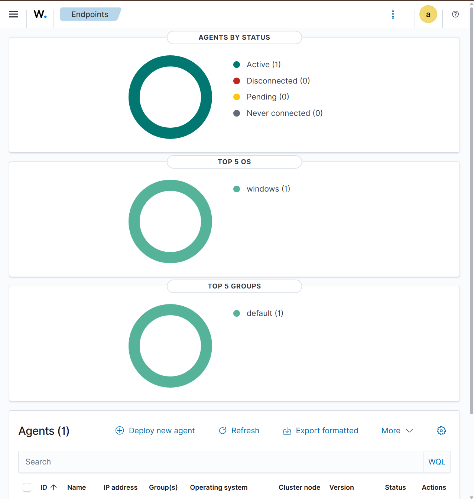
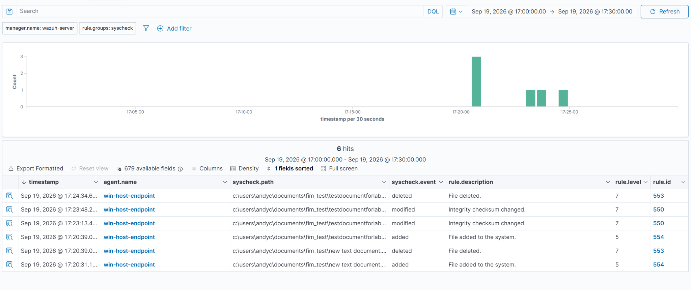
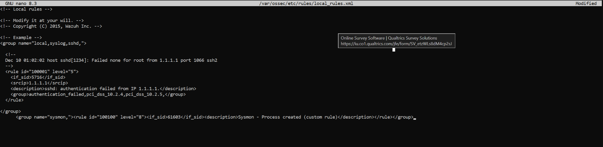
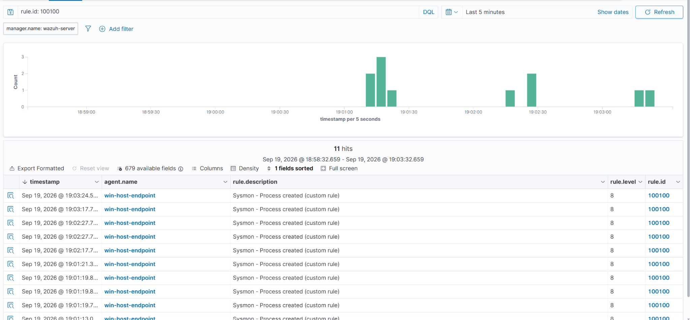
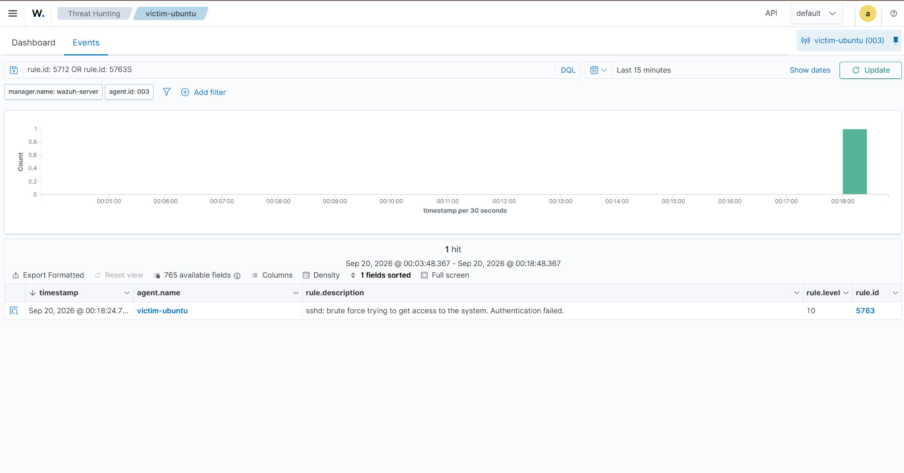
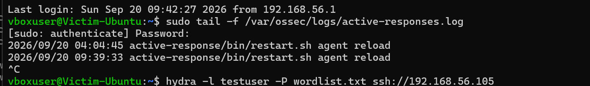
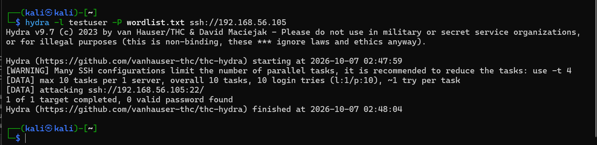
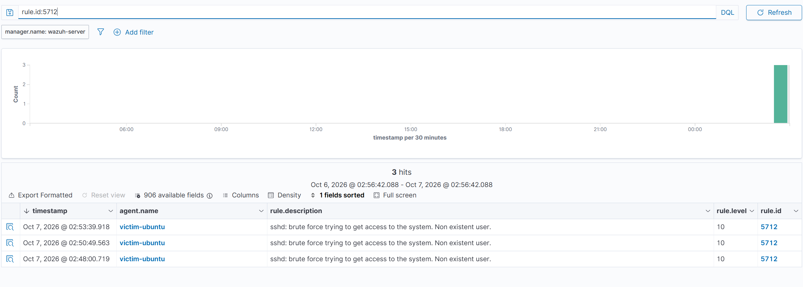

# Home SOC Lab: Wazuh SIEM Deployment & Attack Detection

A self-built Security Operations Center lab covering SIEM deployment, endpoint detection engineering, and a live attack-detection exercise. Built with Wazuh 4.14.7 in VirtualBox across Windows and Linux endpoints.

**Full write-up:** [SOC_Lab_Report.pdf](SOC_Lab_Report.pdf)

## Highlights

- Deployed a Wazuh SIEM (manager, indexer, dashboard) and enrolled Windows and Kali Linux agents
- Designed a segmented host-only + NAT lab network so attack traffic never touches my home network
- Configured File Integrity Monitoring, Microsoft Defender log forwarding, and Sysmon telemetry
- Wrote a custom detection rule (ID 100100) to surface Sysmon process-creation events the default rules missed
- Simulated an SSH brute-force attack with Hydra and detected it end to end through Wazuh's correlation rule 5763
- Diagnosed a silent alert-pipeline failure caused by a full disk and restored it without data loss

## Lab Architecture

| Machine | Role |
| --- | --- |
| Wazuh Server | SIEM manager, indexer, and dashboard (official OVA) |
| Windows PC | Monitored Windows agent |
| Kali Linux | Monitored Linux agent, later used as the attacker |
| Ubuntu Server | Disposable victim for the attack simulation |

- **Adapter 1, Host-only (192.168.56.0/24):** private lab network connecting all machines to Wazuh
- **Adapter 2, NAT (10.0.2.0/24):** outbound internet for updates without exposure to the home LAN

I chose host-only + NAT over bridged networking so the brute-force simulation stayed isolated, IPs stayed stable, and a firewall/IDS layer could be added later.

## File Integrity Monitoring

Configured real-time FIM on test folders on both endpoints. Creating a file triggered level 5 alerts, and modifying or deleting it triggered level 7 alerts, consistently across Windows and Linux.

## Microsoft Defender Integration

Forwarded Defender's Operational event log to Wazuh and validated it with the EICAR test file.

## Sysmon & Custom Detection Rule

Wazuh's dashboard only shows alerts at level 3 or higher, so routine Sysmon events were ingested but invisible. I wrote a custom rule in `local_rules.xml` that raises Sysmon Event ID 1 (process creation) to level 8.

## SSH Brute-Force Attack Simulation

From the Kali VM, I ran a dictionary-based SSH brute-force attack with Hydra against a dedicated Ubuntu victim, keeping the SIEM infrastructure separate from the attack surface.

| Rule | Level | Meaning |
| --- | --- | --- |
| 5760 | 5 | Individual SSH authentication failures |
| 5763 | 10 | Correlated alert: brute force trying to get access |
| 5715 | 3 | Successful authentication |
| 5501 | 3 | Session opened |

## Automated Response: Blocking the Attacker

After detecting the brute force, I configured Wazuh **Active Response** to contain it automatically, moving the lab from detection-only to detection *and* response. When a brute-force alert fires, Wazuh runs the `firewall-drop` command on the victim, which inserts an `iptables` DROP rule against the attacker's IP. A 180-second timeout removes the rule automatically, so a one-off attack doesn't permanently lock out an address.

**Tuning the response to the right rule:** my first tests detected the attack but never triggered a block. By inspecting `/var/ossec/logs/alerts/alerts.log`, I found the attack was firing **rule 5712** ("brute force, non-existent user"), not rule 5763, which my Active Response was originally pointing at. Because I attacked with a username that didn't exist on the victim, Wazuh classified it differently than I expected. Updating the response to trigger on the correct rule ID fixed it, a small but real example of making detection and response actually match.

The block works at the network layer: the victim drops the attacker's traffic, and Hydra can no longer connect, timing out instead of completing.

The dashboard shows the full chain in one view, three brute-force detections (rule 5712) followed by the firewall-drop response (rule 651), with the block landing about one second after detection.

| Rule | Level | Meaning |
| ---- | ----- | ------- |
| 5712 | 10 | Brute force trying to access the system (non-existent user) |
| 651 | 3 | Host blocked by firewall-drop Active Response |

**MITRE ATT&CK:** Credential Access — Brute Force: Password Guessing (T1110.001)

## Troubleshooting: Silent Pipeline Failure

Alerts stopped appearing partway through testing. I traced it to the Wazuh server's 25 GB disk hitting 100%, then:

1. Expanded the virtual disk from 25 GB to 60 GB
2. Grew the partition and filesystem (`growpart` + `xfs_growfs`)
3. Cleared the indexer's read-only lock and restarted services in dependency order (indexer, filebeat, dashboard)

## Known Limitations

- **Suricata IDS:** crashed on startup because the Npcap driver was installed but not running as a service, a known Windows compatibility issue
- **VirusTotal integration:** loaded correctly, but outbound calls failed because the VM's NAT adapter stopped routing to its gateway, a VirtualBox fault confirmed independently of Wazuh

## Tools

Wazuh • VirtualBox • Sysmon (SwiftOnSecurity config) • Microsoft Defender • Hydra • Kali Linux • Ubuntu Server • PowerShell • Bash

## Screenshots

All 16 figures from the report are in the [screenshots](screenshots/screenshots/) folder.
